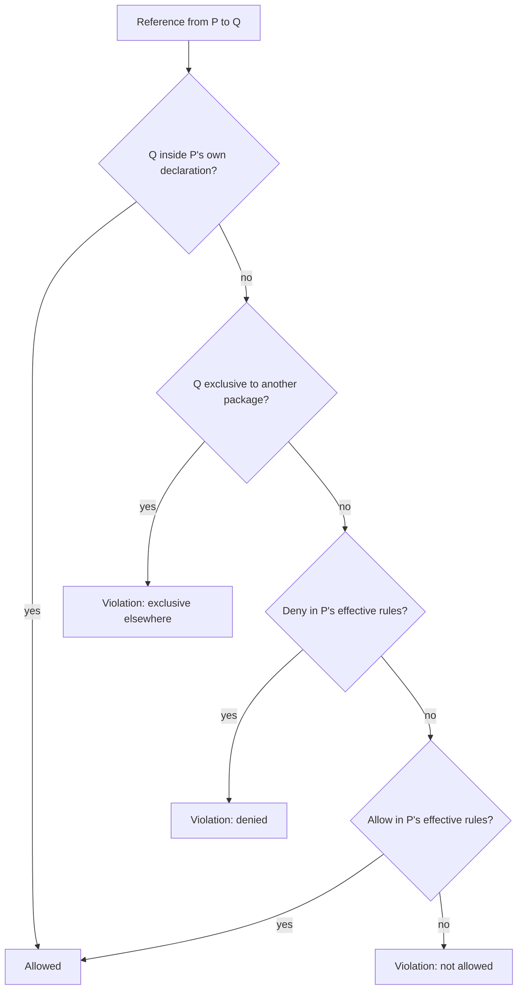

# byterails PRD

As of 2026-09-20 · Willem Veelenturf. The living version of this document is a Claude Doc; this file is its export, updated when the design changes.

## Summary

byterails is a JVM architecture guardrail that fails the build when a class references something its package was never allowed to reference. It reads compiled class files rather than source, so one rule set covers Kotlin, Java and any other JVM language in the same build. Everything is a whitelist: a package may only exist, and may only reference other packages, when the configuration says so.

Pitch: declare the architecture once, and every build proves the code still matches it.

The first release ships three things:

- Package whitelisting with allow, deny and exclusive import rules, inherited down the package tree.
- Class naming conventions per package.
- Gradle and Maven plugins driven by one `byterails.kts` file at the project root.

## Problem

Architecture decisions live in diagrams and heads, and the code drifts away from them one convenient import at a time. A domain package picks up a JPA annotation, a second adapter starts talking to the database directly, and six months later the layering exists only on the wiki.

Existing tools are blacklists. ArchUnit and Konsist ask you to write a rule for every dependency you want to forbid, so anything nobody thought to forbid is silently permitted. The rule set grows with every incident and never becomes a description of the intended design.

byterails inverts this. The configuration lists what may exist and what each package may use, so it reads as the architecture itself, and anything not listed is a violation by construction.

Reading bytecode instead of source keeps the tool small and language-neutral. There is no parser to maintain per language or per compiler version, a mixed Kotlin and Java module needs one rule set, and the references checked are the ones the compiler actually emitted.

## Goals and non-goals

Goals for 1.0:

- A config file that reads as the architecture: packages, what each may use, and what each must be named.
- Whitelist semantics with no hidden defaults. Everything the tool permits is visible in the file.
- Deterministic, complete detection of type references in class files, with every known gap written down.
- One rule model behind Gradle and Maven, with identical results from either.
- Adoption on a brownfield project without a red build, through a report-only mode.
- Fast enough to run on every build: a few seconds on ten thousand classes.

Non-goals for 1.0:

- Source-level analysis. Kotlin/JS, Kotlin/Native and Wasm targets produce no class files and are out of scope.
- Method-level or statement-level rules such as forbidding a specific call. Rules target packages and classes.
- Detecting references hidden in strings, reflection or inlined constants.
- A suppression annotation in production code. Exceptions live only in the config file.
- IDE integration. Feedback arrives from the build.
- Replacing ArchUnit for teams that need its full predicate library.

## Users

Three people meet the tool, and the config file is written for the first while the violation message is written for the second.

| User | Job | What they need from byterails |
| --- | --- | --- |
| Architect or tech lead | Writes and reviews the config, owns exceptions | A file that reads as the design, validated before any scan, and diffs cleanly in review |
| Developer | Sees a violation in a failed build | One message naming the class, the member, the denied type and the rule, plus the source file |
| CI pipeline | Runs the check on every push | A non-zero exit on violations, a report-only switch, and a machine-readable report |

The first target users are Flock projects on Kotlin with Gradle, followed by Maven-based Java services.

## Rule model

The model has one structural concept, three import rules and one naming rule. Everything else is derived from these five.

**Package declaration.** A `pkg("com.acme.domain")` entry declares that the package and its sub-packages may exist. A class whose package is covered by no declaration is a violation. The declaration's body holds the rules for that subtree, and a subtree may always reference itself, so the granularity of declaration is the granularity of enforcement. A declaration marked `flat()` covers the package itself only: a class in a sub-package is undeclared unless another declaration covers it, and that declaration inherits nothing from the flat one.

**Allow.** `allow("org.jooq")` permits references from the declaring subtree to any class under that prefix. It is local and says nothing about other packages.

**Deny.** `deny("jakarta.persistence")` forbids references from the declaring subtree to any class under that prefix. Deny always wins over allow, whatever the specificity of either prefix and wherever in the tree they were declared. The whitelist way to say "Spring except Spring Web" is an allow plus a deny; the way to say "nothing from Spring except Spring Core" is a single allow of Spring Core.

**Exclusive.** `exclusive("org.jooq")` is an allow for the declaring subtree and a deny for every other declared package. A second exclusive on the same prefix anywhere in the config is an error at load time, and so is a plain allow of that prefix elsewhere.

**Inheritance.** Rules flow down. A package's effective rule set is its own rules plus those of every enclosing declaration, up to the root block, whose rules apply everywhere. A child may add allows and may deny what it inherited. An allow that is fully shadowed by an inherited deny is dead, and dead rules are load-time errors.

**Matching.** Every prefix matches on package segment boundaries. `com.acme.domain` covers `com.acme.domain.model` and does not cover `com.acme.domainservice`. Declarations name packages. Rules match their prefix against the fully qualified class name, so a rule may name a class as well as a package: a deny of java.lang.System covers one class and a deny of java.lang covers the package.

**Naming.** A `naming { }` block inside a declaration constrains the simple names of classes in that subtree. A class passes when it matches at least one pattern in the block. Naming blocks do not inherit: the nearest enclosing declaration with a naming block decides.

**Slices.** The rules file may hold one `slice { }` block: the structure every slice of the application has, as template packages and rules. Which slices exist is a build setting, a list of package names relative to the base package, so one rules file serves every project that shares the structure. Template prefixes are relative to the slice when they point into the template's packages and absolute otherwise. An `exported` template package may be referenced from every other slice; nothing else crosses a slice boundary, because the whitelist already forbids it. A template exclusive is owned by that package of every slice together. A block without configured slices, or configured slices without a block, is a load-time error. The template expands into ordinary declarations, so every rule above applies unchanged.

**Modules.** A build module, a Gradle subproject or a Maven module, may be a byterails module: a package under the base package, named in the build, that the module's classes must live in and no other module may put classes in. The module root is declared implicitly and covers its subtree, like a slice root. The module may have a `byterails.kts` of its own next to its build file; the top-level allows and denies of that file are the rules of the module root, inherited by the module's packages, with the root file's root block underneath, and its declarations are relative to the module, with rule prefixes following when they point into the module's declared packages. The module file only adds: it may not declare a package the root file declared, and `basePackage { }` is not allowed in it. `exported("api")` in a module file lets every other module, and nothing else, reference that package. A `slice { }` block in the module file applies to the slices configured on the module's project, which lie under the module, and default rules configured on the module apply under it, a set that declares the base package describing the module root. Every module's check loads the root file and every module's file, so exclusives, cycles and exports are decided across the build. A class compiled in the wrong module is a violation of its own kind and is checked no further.

**Isolated packages and default rules.** A declaration marked `isolated()` inherits nothing, not the root block and not its enclosing declarations; its classes may reference only what it lists and its own subtree. Default rule sets ship with byterails in the `byterails-rules` module, each written with the rules-file DSL so that what it declares reads as a rules file, and are applied by id from the rules file or from the build, in which case the rules file may be absent. The core finds them through a service-loader provider and knows a set by its id only. `java` allows the Java standard library in every package: the `java` namespace, the `javax` and `com.sun` packages the JDK exports, `jdk`, and the DOM, SAX and JGSS packages. `kotlin` allows `kotlin`, `org.jetbrains.annotations` and everything in `java`, because Kotlin's collections and strings compile to Java types. `hexagonal` declares a `domain` package in every slice, or under the base package without slices, that is isolated and allows only the language baseline: `kotlin`, `org.jetbrains.annotations`, `java.lang`, `java.util`, `java.time`, `java.math` and `java.text`. `hexagonalSpring` is the whitelist form of the hexagonal layout common to sliced Spring Boot services: under the base package a flat declaration for the application class and a `config` package that own `@Configuration`, both unrestricted; in every slice a flat, isolated `domain.model`, `domain.ports` and `domain.services` allowing the standard libraries and `org.springframework.stereotype`, an `application` layer, and `adapters.inbound` and `adapters.outbound` with dependencies pointing inwards, `controllers` owning `org.springframework.web.bind.annotation` and limited to the Spring packages HTTP needs, and a flat `database` with `model` and `mappers` holding the persistence libraries. An unrestricted package carries an allow of the empty prefix, which the base-package and slice rewrites leave alone and which draws no edge in cycle detection. Rule-set allows show as one `[id]` token in a violation, with a hint that spells the set out, and are never reported as dead: narrowing a rule set with a deny or an exclusive is expected. A rule set's declarations cannot be widened from the rules file, since declaring the same package twice is an error; the layout is widened through root and slice-root allows and refined through sub-package declarations.

Every reference from a class in package P to a type in package Q is evaluated in this order:



The last branch is what makes byterails a whitelist: a reference nobody thought about is a violation, not a pass.

## Configuration file

One `byterails.kts` file at the project root is the single source of rules for Gradle and Maven alike. Both plugins evaluate it with the Kotlin scripting host and hand the resulting rule model to the same analysis core.

Declarations are flat and use absolute package names. Inheritance follows the package tree, never the nesting of the file, so the file stays a plain list that diffs well in review.

```kotlin
// byterails.kts
byterails {
    // Root rules: inherited by every declared package. The first three are what the
    // Kotlin compiler writes into every class; nothing is allowed implicitly.
    allow("kotlin")
    allow("java.lang")
    allow("org.jetbrains.annotations")
    allow("java.util")
    allow("java.time")

    // Entry point and wiring only. Its self-reference covers the whole app.
    pkg("com.acme") {
        allow("org.springframework.boot")
        allow("org.springframework.context")
    }

    pkg("com.acme.domain") {
        deny("java.util.concurrent")   // narrows the inherited java.util
    }

    pkg("com.acme.application") {
        allow("com.acme.domain")
        exclusive("org.springframework.transaction")
        naming { endsWith("UseCase") }
    }

    pkg("com.acme.infra.persistence") {
        allow("com.acme.domain")
        allow("com.acme.application")
        exclusive("org.jooq")
        naming { endsWith("Repository") }
    }

    pkg("com.acme.infra.web") {
        allow("com.acme.application")
        exclusive("org.springframework.web")
        naming {
            endsWith("Controller")
            endsWith("Advice")
        }
    }
}
```

Two details of this example matter. The implicit self-reference of `com.acme` does not flow down to `com.acme.domain`, because only explicit rules inherit; otherwise every layer could reach every other through the root. And `com.acme.domain` needs no allow of its own package, because a declared subtree may always reference itself.

The file is evaluated once per build into an immutable rule model. Before any class file is read, the model is validated and the build fails on any of these:

- A malformed prefix: empty, a trailing dot, or a segment that is not a legal identifier.
- The same package declared twice.
- Two exclusives on one prefix, or an exclusive and a plain allow of the same prefix in different packages.
- An allow fully shadowed by a deny in the same effective rule set.
- A naming pattern that is not a valid regular expression.

Two more checks produce warnings rather than errors in 0.1. A cycle among declared packages, where A allows B and B allows A, is reported with the cycle spelled out. An allow or deny of a Kotlin package whose types compile to Java ones, such as `kotlin.collections`, is reported with the JVM package it probably meant.

The rule model is plain data. It can be exported as JSON for diffing, documentation and diagrams in a later release.

## Requirements: packages and imports

These are the requirements the rule model implies, numbered so the milestones and tests can cite them.

1. **FR-1 Package existence.** Every scanned class must lie in a declared package subtree. A class outside every declaration is reported as an undeclared package, naming the class and the nearest declared ancestor if one exists.
2. **FR-2 Reference evaluation.** Every type reference found by the analysis scope is evaluated in the order of the rule model flowchart: own subtree, exclusive elsewhere, deny, allow, otherwise not allowed.
3. **FR-3 Allow is local.** An allow permits references only from the declaring subtree and its descendants. It never affects other packages.
4. **FR-4 Deny wins.** A deny in the effective rule set defeats any allow in the same set, regardless of prefix length or where in the tree each was declared.
5. **FR-5 Exclusive.** An exclusive on a prefix permits the declaring subtree and denies every other declared package. Duplicate exclusives, or an exclusive alongside a plain allow of the same prefix elsewhere, fail at load time.
6. **FR-6 Inheritance.** Effective rules for a package are the union of its own explicit rules and those of every enclosing declaration and the root block. The implicit self-reference of a declaration does not inherit.
7. **FR-7 Self-reference.** A class may reference any class inside its own nearest declared subtree without an allow.
8. **FR-8 Segment matching.** All prefixes match only at package segment boundaries, for declarations and for every rule kind.
9. **FR-9 Load-time validation.** The checks listed under Configuration file run before any class file is read, and any error stops the build with the offending line of the config.
10. **FR-10 Scope of classes.** The check covers the main output classes of a module. Test classes are excluded in 0.1 and become a separately configured scope later.
11. **FR-11 Generated code.** Generated classes that land in a declared package are checked like any other class for imports. There is no exemption, because a generated adapter that reaches into the domain is still a violation.
12. **FR-12 Failure.** One or more violations fail the build task with a non-zero status unless report-only mode is active.
13. **FR-12a Base package.** The plugin and the CLI accept an optional base package. Every declaration in the rules file is prefixed with it. A rule prefix is prefixed when the prefixed form points into the declared package tree, that is it covers a declaration or a declaration covers it, and is left as written otherwise. A malformed base package is a load-time error.
14. **FR-12b Modules.** The plugins accept a module name per build module and find every module's rules file through the build. A class of a module project outside the module's package, or a class inside a module's package compiled by any other project, is reported as `WRONG MODULE` and checked no further. A module name that is malformed, configured twice, or nested in another module, a module file with `basePackage { }`, a root file with `exported`, a module root the root file also declares, and a module rules file next to a build file that names no module are load-time errors.

## Requirements: naming

Naming rules constrain the simple name of a class, which is the binary name after the last dot.

1. **FR-13 Patterns.** A naming block accepts `endsWith("X")`, `startsWith("X")` and `matches(Regex)` on the simple class name.
2. **FR-14 Any-of.** A class passes when at least one pattern in the block matches. An empty naming block is a load-time error.
3. **FR-15 Scope.** Naming applies to classes in the declaring subtree. In 0.1 any class whose binary name contains a dollar sign is skipped, which drops companions, lambdas, coroutine state machines and also user-written nested classes. In 1.0 the skip is driven by the kind recorded in the Kotlin Metadata annotation, so only compiler-generated classes are skipped and nested classes the user wrote are checked.
4. **FR-16 File facades.** A Kotlin file with top-level functions compiles to a class named after the file with a `Kt` suffix. In 0.1 it is an ordinary class: a package with top-level functions adds `endsWith("Kt")` to its naming block or keeps its top-level functions in a package without naming rules. In 1.0 file facades are skipped through the Metadata kind.
5. **FR-17 Generated classes.** A class carrying an annotation whose simple name is `Generated` is skipped by naming rules and still checked by import rules.
6. **FR-18 No inheritance.** The nearest enclosing declaration with a naming block decides. A subtree without one inherits nothing.
7. **FR-19 Message.** A naming violation names the class, its package, every pattern that was tried, and the config line of the naming block.
8. **FR-20 Later.** Kind-aware rules, such as interfaces in a package ending with Port, and annotation-conditioned rules, such as classes annotated RestController ending with Controller, are planned for 0.3 and are not in 0.1.

## Requirements: analysis scope

A reference is any class name the compiler wrote into a class file, wherever it wrote it. The list below is exhaustive on purpose: a deny rule is only as strong as the weakest place the analysis forgets to look.

1. **FR-21 Class header.** Superclass, interfaces, the class's generic signature, and every annotation on the class including the types inside annotation arguments.
2. **FR-22 Fields.** The descriptor type, the generic signature, and annotations.
3. **FR-23 Method declarations.** Parameter and return types from the descriptor, the generic signature, declared exceptions, annotations on the method and on each parameter, and annotation default values.
4. **FR-24 Method bodies.** The owner and type of every field access and method call, every `new`, array creation, cast and `instanceof`, class and method-type constants loaded by `ldc`, catch types of exception handlers, and every local variable type when the local variable table is present.
5. **FR-25 Invokedynamic.** The call-site descriptor, the bootstrap method's owner, and every type, handle and method type among the bootstrap arguments. This covers Kotlin 2.0 lambdas, Java lambdas and method references, string concatenation and record methods.
6. **FR-26 Synthetic members are scanned.** The dollar-sign skip that naming rules apply never applies here. Lambda bodies, coroutine continuation classes, bridge methods and file facades are all read.
7. **FR-27 Kotlin Metadata.** In 0.1 the Metadata annotation is a reference like any other, so the root block allows the kotlin package. In 1.0 its kind field drives the naming skip. Its content is never used to find references.
8. **FR-28 Primitives and arrays.** Primitive types and arrays of them are not references. The element type of an object array is.
9. **FR-29 Nesting attributes.** The inner-class attribute records nesting and is not a reference. Each nested class is checked as its own class file.
10. **FR-30 JVM names.** Rules are written in JVM package names. Kotlin collection and primitive types compile to java packages, and the config warns for the known mappings.
11. **FR-31 Fixture corpus.** Every construct above has a compiled fixture in the test suite: a Kotlin or Java snippet, the expected set of references, asserted against the output of the oldest and newest supported compilers.
12. **FR-32 Class file versions.** The ASM version is pinned to read the newest JDK class file version at release time, and an unsupported newer version fails with a message naming the JDK, not a stack trace.

## Requirements: reporting

The violation message is the product for most people who meet byterails, so it is specified as tightly as the rules.

1. **FR-33 Violation message.** Every violation prints as one block with the kind, the class, the member when there is one, the referenced type, the rule that decided with its line in the config, and the source file from the class file's source attribute. A line number is added only when the reference sits in a method body and the line number table has one.
2. **FR-34 Not-allowed explains itself.** A not-allowed violation lists the effective allows of the package, so the developer sees what the package may use without opening the config.
3. **FR-35 Ordering.** Violations are grouped by package, then class, then member, in stable sorted order, followed by one summary line with counts per kind.
4. **FR-36 Report-only mode.** A plugin setting or a command-line property switches every violation to a warning and lets the task succeed. It lives in the build configuration, not in the rules file, so the rules file stays a pure description of the architecture.
5. **FR-37 Report file.** Every run writes a JSON report with the same content as the console output, under the build tool's report directory, with a stable schema. SARIF and JUnit XML are generated from it in 0.3.
6. **FR-38 Clean run.** Zero violations print one line with the number of classes and packages checked.
7. **FR-39 Failure shape.** The task fails with a single exception whose message is the summary line. The full list is printed above it, so the build tool's own failure output stays short.
8. **FR-40 No suppression in code.** There is no annotation to silence a violation. The escape hatch is an allow in the config, reviewed like any other change. Expiring allows, which turn back into violations after a date, are planned for 0.3.

Two messages as a developer would see them:

```
byterails: DENIED       com.acme.domain.Order
  field    entityManager : jakarta.persistence.EntityManager
  rule     deny("jakarta.persistence")            byterails.kts:14
  source   Order.kt

byterails: NOT ALLOWED  com.acme.domain.OrderService
  method   place(Order) : void
  ref      org.springframework.web.client.RestTemplate
  allows   kotlin, java.lang, java.util, java.time, com.acme.domain
  source   OrderService.kt:42

byterails: 2 violations in 1,204 classes, 17 packages
```

## Requirements: build integration

The product is three artifacts: a core library and two thin plugins. Rules are per package, not per module, so every module checks its own classes against the whole rule file and nothing needs to be aggregated.

1. **FR-41 Core library.** `byterails-core` holds the rule model, the script evaluation, the ASM analysis and the reporter, with no dependency on either build tool. Anyone can call it from a plain JVM test.
2. **FR-42 Gradle plugin.** Applied per project, it adds a `byterailsCheck` task wired into `check`. Inputs are the rules file and the project's main class directories; the output is the JSON report. The task is cacheable, works under the configuration cache, and runs in a worker with classloader isolation so the plugin's ASM and Kotlin scripting versions never clash with the build's.
3. **FR-43 Maven plugin.** A `check` goal bound to the `verify` phase, run per module, with the rules file defaulting to `byterails.kts` in the multi-module root directory.
4. **FR-44 Identical results.** The same class directories and rules file produce the same report from both plugins, proven by a test that runs both on one fixture project.
5. **FR-45 Script cost.** The rules file is compiled once and cached by content hash under the build directory, so only a changed file pays the compile.
6. **FR-46 Multi-module.** One rules file at the root covers every module. Because a class is checked exactly once, in its own module, per-module runs give the same result as a whole-project run and stay incremental. With byterails modules, every module's run loads the root file plus the rules file of every module, so the run still has the whole picture and no aggregation is needed; the module files are inputs of every module's task.
7. **FR-47 Versions.** The plugins run on JDK 17 or newer, Gradle 8 or newer and Maven 3.9 or newer, and read class files from JDK 8 up to the newest release.
8. **FR-48 Nothing on the user's classpath.** The plugins add no dependency to the compile, runtime or test classpath of the project being checked.

## Non-functional requirements

byterails runs on every build, so speed and isolation are requirements, not nice-to-haves.

| Area | Requirement |
| --- | --- |
| Analysis speed | 10,000 classes in under 3 seconds on a developer laptop, excluding script compilation |
| Script compilation | First evaluation of the rules file under 5 seconds, then cached by content hash |
| Memory | Streaming analysis with one class file in memory at a time; only violations are retained |
| Determinism | Same inputs give byte-identical reports with stable ordering |
| Isolation | Plugin dependencies live in an isolated classloader and never reach the project's compile, runtime or test classpath |
| Compatibility | JDK 17 or newer to run; class files from JDK 8 to the newest release; Kotlin 1.9 and 2.x output; Gradle 8; Maven 3.9 |
| Build caching | The Gradle task is cacheable and configuration-cache compatible |
| Failure clarity | Every expected failure is a message with a config line or a class name, never a stack trace; internal errors print an issue link |
| Footprint | Two runtime dependencies in the core, ASM and the Kotlin scripting host, both pinned |

## Known limitations

These follow from reading bytecode and are documented in the README rather than worked around. A whitelist tool fails quietly on a missed reference, so each one is stated plainly.

- **Inlined constants.** A Kotlin `const val` or a Java `static final` primitive or String is copied into the user at compile time. A package that only reads constants from a denied package produces no violation.
- **Inline functions.** The body of a Kotlin `inline fun` is copied into every caller, so the caller carries the references of the inlined body. byterails reports what the class file contains, which means the violation appears in the caller's package.
- **Strings and reflection.** A class named in a string, through reflection, component scanning by package name or a serialization type id, is invisible.
- **Type aliases and source-retention annotations.** Neither exists in bytecode.
- **Value classes.** A Kotlin inline value class erases to its underlying type in most signatures, so a rule naming the value class cannot see those uses.
- **Debug information.** Local variable types exist only when the compiler emits the local variable table. Both compilers emit it by default, and a build that strips it loses those references.
- **Multiplatform.** Only JVM targets produce class files. Kotlin/JS, Kotlin/Native and Wasm are out of scope.
- **Members.** Rules see types, not members. Banning a class bans every use of it, including a harmless one.

## Decisions log

Decided rows come from the design interview of 20 September 2026. Proposed rows are choices this PRD makes where the interview gave no answer or where the answer had a flaw, and they stand until changed here.

| # | Topic | Choice | Status |
| --- | --- | --- | --- |
| 1 | Exclusive | An opt-in keyword; a plain allow is local | Decided |
| 2 | Implicit allows | None; the root block allows kotlin, java.lang and org.jetbrains.annotations explicitly, the three prefixes the Kotlin compiler writes into every class | Decided |
| 3 | Sub-packages | A declaration covers its sub-packages | Decided |
| 4 | Inheritance | Rules inherit down the package tree | Decided |
| 5 | Exclusive clash | Two exclusives on one prefix fail at load time | Decided |
| 6 | Adoption | Report-only mode; no config generator and no freeze file | Decided |
| 7 | Rule names | Written in JVM names | Decided |
| 8 | Naming scope | Classes with a dollar sign in the name are skipped by naming rules in 0.1 | Decided |
| 9 | Naming patterns | Suffix, prefix and regex in the first release | Decided |
| 10 | Maven | The rules file is evaluated with the Kotlin scripting host | Decided |
| 11 | Packaging | A build plugin is the product, not a test library | Decided |
| 12 | Matching | Segment-aware; the interview chose plain string prefix, which makes domain match domainservice | Proposed |
| 13 | Config host | One standalone rules file for both build tools; the interview allowed a build.gradle.kts block too | Proposed |
| 14 | Precedence | Deny wins over allow at any specificity | Proposed |
| 15 | Self-reference | A declared subtree may reference itself, and that right does not inherit | Proposed |
| 16 | Exclusive vs allow | An exclusive plus a plain allow of the same prefix elsewhere fails at load time | Proposed |
| 17 | Dead rules | An allow fully shadowed by a deny fails at load time | Proposed |
| 18 | Analysis depth | Generic signatures and invokedynamic are analysed from 0.1 | Proposed |
| 19 | Constants | Inlined constants are a documented limitation | Proposed |
| 20 | Kotlin names | Kotlin packages that compile to java packages warn at load | Proposed |
| 21 | Class prefixes | A rule prefix may name a class, not only a package | Proposed |
| 22 | Generated code | Classes annotated Generated skip naming rules only | Proposed |
| 23 | Test classes | Excluded in 0.1 | Proposed |
| 24 | Messages | Violation format as in FR-33 | Proposed |
| 25 | Escape hatch | No suppression annotation; expiring allows in 0.3 | Proposed |
| 26 | Cycles | Cycles among declared packages warn at load | Proposed |
| 27 | Modules | Per-module runs; a run loads the root file plus every module's rules file; no aggregation | Decided |
| 28 | Core library | Shipped alongside the plugins with no build-tool dependency | Proposed |
| 29 | Base package | A plugin input prefixes every declaration; rule prefixes follow when they point into the declared tree | Decided |
| 30 | Slices | The rules file describes one slice in a slice block; the build names the slices; exported packages are the only cross-slice references; template exclusives are owned by every slice together | Decided |
| 31 | Default rules | Shipped rule sets applied by id from the file or the build: java and kotlin allow the standard libraries everywhere, hexagonal declares an isolated domain package per slice with the language baseline only, hexagonalSpring declares the hexagonal layout of a sliced Spring Boot service; rule-set allows show as one token and are never dead | Decided |
| 32 | Flat declarations | `flat()` covers the package itself only, so a layout can forbid sub-packages and keep a base-package declaration from swallowing the slices | Decided |
| 33 | Module identity | One build module is at most one byterails module, named explicitly in the build; the name, possibly several segments, is appended to the base package; the module root is declared implicitly and covers its subtree; modules and slices combine, slices lying under the module | Decided |
| 34 | Module rules file | A `byterails.kts` next to the module's build file, found by convention; top-level rules are the module root's; declarations are relative to the module and only add to the root file; no `basePackage { }`; a file without a module name is an error, a module without a file is fine; a violation names the file by its root-relative path | Decided |
| 35 | Module boundaries | Producer-side `exported("api")` grants the package to the other modules only; a class compiled in the wrong module is a `WRONG MODULE` violation; default rules and root allows configured on a module apply under the module root | Decided |
| 36 | Module discovery | From the build at configuration time: every Gradle project with the plugin and a module name, every Maven reactor module whose POM configures `<module>`; the core implements the DSL, the merge and the violation, the CLI gains no module flags | Decided |

## Coverage check: source-level guardrails

Teams adopting byterails usually replace an ArchUnit- or Konsist-based guardrails module. The table maps the rule categories such a module contains onto this PRD, with the byterails config that expresses each or the reason it cannot. The package and dependency categories are what the `hexagonalSpring` rule set ships for a sliced Spring Boot service.

| Rule category | Typical ArchUnit form | byterails | How |
| --- | --- | --- | --- |
| Layer dependencies | domain must not depend on infra | Yes, 0.1 | allow and deny |
| One layer owns a library | only persistence uses JPA or jOOQ | Yes, 0.1 | exclusive |
| Naming by package | classes in service end with Service | Yes, 0.1 | naming block |
| Forbidden library | no java.util.logging, no Joda-Time | Yes, 0.1 | deny on the package |
| Forbidden class | no java.lang.System, no Thread | Yes, 0.1 | deny on the class name, every use of it |
| Naming by annotation | RestController classes end with Controller | 0.3 | FR-20 |
| Containment by annotation | Entity classes live in domain | 0.3 | FR-20 |
| Kind rules | classes in port are interfaces | 0.3 | FR-20 |
| Field injection | no Autowired on fields | Partial | deny bans the annotation everywhere, fields and constructors alike |
| Generic exceptions | no throw RuntimeException | Partial | deny bans every use of the class, including catch |
| Slice cycles | slices free of cycles | Partial | config-level warning in 0.1, no bytecode-level check |
| Forbidden member | no System.out, no printStackTrace | No | member-level rules are a non-goal |
| Deprecated API use | no dependency on Deprecated classes | No | annotations on the target class are not read |
| Access modifiers | utility classes have a private constructor | No | non-goal for 1.0 |
| Test conventions | test classes end with Test | No | test scope excluded, FR-10 |

## Open questions

Each of these changes a requirement above once answered.

- [ ] Exclusive in a child package while an ancestor allows the same prefix: a load-time error like the clash rule, or the child wins?
- [ ] Test classes: a `tests { }` block in the same file with its own root allows, a second file, or never?
- [ ] A deny of a prefix that no package allows is redundant: warn, or stay silent?
- [ ] Naming any-of semantics: confirmed, or should several patterns all have to hold?
- [ ] Should the plugin take a package filter, so a team adopting byterails can make one package green at a time?
- [ ] How are breaking changes to the DSL communicated, given the rules file compiles against the plugin version?
- [ ] JSON export of the rule model, for diffs and diagrams: 0.2 or 1.0?

## Milestones

Four releases, each with an exit criterion that a real project has to meet, not a feature list alone. The 0.1 scope and the Maven plugin from 0.2 were implemented on 21 September 2026; the exit criteria, a Flock project and a Maven service green in CI, are still open.

| Version | Scope | Exit criterion |
| --- | --- | --- |
| 0.1 | Core library, rule model, load-time validation, full analysis scope (FR-21 to FR-32), console and JSON report, report-only mode, Gradle plugin, fixture corpus | One Flock project green in CI with a real rules file; the 10,000-class benchmark under 3 seconds |
| 0.2 | Maven plugin, identical-results test, naming rules (FR-13 to FR-19), script compile cache | One Maven-based Java service adopted with the same rules file shape |
| 0.3 | Kind-aware and annotation-conditioned naming, Metadata-driven synthetic skip, expiring allows, SARIF and JUnit XML, JSON export of the rule model, test scope | Every row of the coverage table reads Yes or a documented No |
| 1.0 | DSL frozen, documentation, limitations page, migration notes | Three projects on it for a quarter with no breaking DSL change |

## Success metrics

| Metric | Target | How it is measured |
| --- | --- | --- |
| Time to first green config | Under one working day for a project of about 200 packages | Recorded on each adoption |
| Analysis time | Under 3 seconds per 10,000 classes | Benchmark fixture run in CI on every commit |
| Detection completeness | Every reference in the fixture corpus found on the oldest and newest supported compilers | Regression gate in CI |
| Adoption | Three Flock projects running the check in CI by 1.0 | Count |
| Hidden defaults | Zero | Review of the core: every permitted reference traces to a line in the rules file |
| Temporary exceptions | Expiring allows trend down per project after the first month | Read from the rules file by the 0.3 export |

## Alternatives considered

byterails is not the first tool in this space, and its claim is a smaller model rather than more power. The honest comparison is below.

| Alternative | What it is | Why not for this job | What byterails takes from it |
| --- | --- | --- | --- |
| ArchUnit | JUnit-based bytecode rules with a large predicate library | Blacklist by default, so the rule set grows with incidents; no package existence whitelist; verbose for the common layering case | Bytecode analysis, the freezing-rule idea behind expiring allows |
| Konsist | Kotlin source rules over the PSI, run as tests, covers multiplatform | Source only, Kotlin only, so a mixed Kotlin and Java module needs a second tool | Kotlin-first DSL ergonomics |
| JPMS | Compiler-enforced exports and requires per module | Requires splitting into modules, which most codebases have not done; no naming rules; no single place that says who owns a library | The whitelist mindset |
| Gradle module boundaries | api versus implementation scopes across subprojects | Coarse-grained and again requires splitting modules; byterails works inside one module | Nothing directly |
| Detekt | Kotlin style and complexity linter on source | Not an architecture tool; it sits in the same fails-the-build slot, which is why teams mention it | Report formats and plugin conventions |
| jQAssistant, Sonargraph | Graph-database or commercial architecture analysis | Heavy setup and a separate server or licence for a check that should take seconds | Nothing directly |
